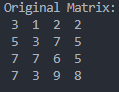

# Homework 1 - Matrix4x4

## Matrix 類別

`Matrix` 類別提供基本的方陣運算功能，包括存取、轉置、旋轉、行列式與反矩陣計算。  
使用動態配置的一維陣列 (row-major) 儲存元素，僅支援 **方陣 (square matrix)**。

---

### 方法列表

#### 建構與解構

| 方法                  | 說明                      |
| --------------------- | ------------------------- |
| `Matrix(int size)`    | 建立 size × size 的矩陣。 |
| `~Matrix()`           | 解構子，釋放矩陣記憶體。  |
| `int GetSize() const` | 取得矩陣維度大小 (n)。    |

#### 元素操作

| 方法                                       | 說明           |
| ------------------------------------------ | -------------- |
| `void Set(int row, int col, double value)` | 設定矩陣元素。 |
| `double Get(int row, int col)`             | 取得矩陣元素。 |

#### 查詢

| 方法                | 說明                 |
| ------------------- | -------------------- |
| `double Largest()`  | 取得矩陣中的最大值。 |
| `double Smallest()` | 取得矩陣中的最小值。 |

#### 結構轉換

| 方法               | 說明                                      |
| ------------------ | ----------------------------------------- |
| `void Transpose()` | 矩陣轉置 (將元素 (i, j) 與 (j, i) 互換)。 |
| `void Rot90()`     | 將矩陣順時針旋轉 90 度。                  |

#### 取得子集合

| 方法                                       | 說明                   |
| ------------------------------------------ | ---------------------- |
| `std::vector<double> GetRow(int row)`      | 取得指定列的元素向量。 |
| `std::vector<double> GetCol(int col)`      | 取得指定行的元素向量。 |
| `std::vector<double> GetDiagonal()`        | 取得主對角線元素向量。 |
| `std::vector<double> GetInverseDiagonal()` | 取得副對角線元素向量。 |

#### 線性代數運算

| 方法                            | 說明                                                                            |
| ------------------------------- | ------------------------------------------------------------------------------- |
| `double CalculateDeterminant()` | 計算矩陣行列式。<br>※ 使用 Laplace 展開法，時間複雜度 O(n!)，僅適用於小矩陣。   |
| `Matrix Invert()`               | 計算矩陣反矩陣 (Inverse)。<br>※ 若行列式為 0，會丟出例外 `std::runtime_error`。 |

---

### 其他函數

| 函數                                                          | 說明               |
| ------------------------------------------------------------- | ------------------ |
| `void fillMatrixWithRandom(Matrix &matrix, int min, int max)` | 填充隨機亂數到矩陣 |
| `void printMatrix(Matrix &matrix)`                            | 印出矩陣           |
| `void printVector(std::vector<double> vec)`                   | 印出陣列           |

---

### 範例

宣告矩陣，隨機填充 1~9 進去:

```c++
Matrix matrix(4);
fillMatrixWithRandom(matrix, 1, 9);

std::cout << "Original Matrix:" << std::endl;
printMatrix(matrix);
std::cout << std::endl;
```



找出矩陣中最大最小值:

```c++
std::cout << "Largest: " << matrix.Largest() << std::endl;
std::cout << "Smallest: " << matrix.Smallest() << std::endl;
std::cout << std::endl;
```


矩陣轉至:

```c++
matrix.Transpose();
std::cout << "Transposed Matrix:" << std::endl;
printMatrix(matrix);
std::cout << std::endl;
```


矩陣順時鐘 90 度旋轉:

```c++
matrix.Rot90();
std::cout << "Rotated 90 Degrees Matrix:" << std::endl;
printMatrix(matrix);
std::cout << std::endl;
```


找出特定列、行、主對角線、副對角線:

```c++
std::vector<double> row = matrix.GetRow(2);
std::cout << "Row with index 2: ";
printVector(row);
std::cout << std::endl;

std::vector<double> col = matrix.GetCol(2);
std::cout << "Column with index 2: ";
printVector(col);
std::cout << std::endl;

std::vector<double> diag = matrix.GetDiagonal();
std::cout << "Main Diagonal: ";
printVector(diag);
std::cout << std::endl;

std::vector<double> invDiag = matrix.GetInverseDiagonal();
std::cout << "Inverse Diagonal: ";
printVector(invDiag);
std::cout << std::endl;
```


計算行列式:

```c++
int det = matrix.CalculateDeterminant();
std::cout << "Determinant: " << det << std::endl;
std::cout << std::endl;
```


找出反矩陣:

```c++
Matrix inv = matrix.Invert();
std::cout << "Inverted Matrix:" << std::endl;
printMatrix(inv);
```


