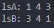
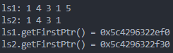
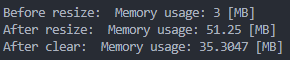
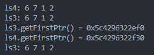
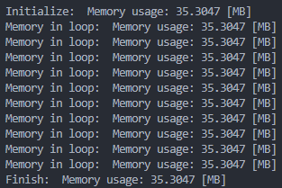

# Homework 2 - Linked List

## LinkedList 類別

`LinkedList` 類別實作了一個單向鏈結串列 (Singly Linked List)，
支援節點新增、列印、拷貝、指派與自動記憶體釋放等功能。

### 方法列表

| 方法                                                   | 說明                                    |
| ------------------------------------------------------ | --------------------------------------- |
| `LinkedList()`                                         | 建構子，初始化空的鏈結串列。            |
| `LinkedList(const LinkedList<T> &other)`               | 複製建構子，建立新的串列副本 (深拷貝)。 |
| `~LinkedList()`                                        | 解構子，釋放所有節點記憶體。            |
| `LinkedList<T>& operator=(const LinkedList<T>& other)` | 指派運算子，實作深拷貝與指派。          |
| `void push_back(const T &value)`                       | 在串列尾端加入新節點。                  |
| `void push_front(const T &value)`                      | 在串列前端加入新節點。                  |
| `void Print() const`                                   | 印出串列內容。                          |
| `ListNode<T>* getFirstPtr() const`                     | 回傳第一個節點指標。                    |

## 題目討論

### Question 0

```cpp
void question0()
{
    LinkedList<size_t> lsA, lsB;
    lsA.push_back(1);
    lsA.push_back(4);
    lsA.push_back(3);
    lsB.push_front(1);
    lsB.push_front(4);
    lsB.push_front(3);

    std::cout << "lsA: ";
    lsA.Print();
    std::cout << "lsB: ";
    lsB.Print();
    std::cout << std::endl;
}
```

輸出如下



### Question 1、2

```cpp
void question1_2()
{
    // question 1
    LinkedList<size_t> ls1;
    ls1.push_back(1);
    ls1.push_back(4);
    ls1.push_back(3);
    ls1.push_back(1);

    // question 2
    LinkedList<size_t> ls2 = ls1;
    ls1.push_back(5);

    std::cout << "ls1: ";
    ls1.Print();
    std::cout << "ls2: ";
    ls2.Print();
    std::cout << "ls1.getFirstPtr() = " << ls1.getFirstPtr() << std::endl;
    std::cout << "ls2.getFirstPtr() = " << ls2.getFirstPtr() << std::endl;
    std::cout << std::endl;
}
```

ls1 和 ls2 內容不一樣，且第一個元素的地址不同



### Question 3

```cpp
void question3()
{
    std::vector<LinkedList<size_t>> v;
    std::cout << "Before resize:  ";
    print_pages();
    size_t num1 = 65536 * 16;
    v.resize(num1);
    for (size_t i = 0; i < num1; ++i)
    {
        v[i].push_back(i);
    }
    std::cout << "After resize:  ";
    print_pages();
    v.clear();
    v.shrink_to_fit();
    std::cout << "After clear:  ";
    print_pages();
    std::cout << std::endl;
}
```

沒問題，因為有正確撰寫解構子

```cpp
template <typename T>
LinkedList<T>::~LinkedList()
{
    ListNode<T> *current = head;
    while (current)
    {
        ListNode<T> *next = current->GetNext();
        delete current;
        current = next;
    }
    head = nullptr;
    len = 0;
}
```



### Question 4

```cpp
void question4()
{
    LinkedList<size_t> ls3;
    {
        LinkedList<size_t> ls4;
        ls4.push_back(6);
        ls4.push_back(7);
        ls4.push_back(1);
        ls4.push_back(2);
        ls3 = ls4;
        std::cout << "ls4: ";
        ls4.Print();
        std::cout << "ls3: ";
        ls3.Print();
        std::cout << "ls3.getFirstPtr() = " << ls3.getFirstPtr() << std::endl;
        std::cout << "ls4.getFirstPtr() = " << ls4.getFirstPtr() << std::endl;
    }

    std::cout << "ls3: ";
    ls3.Print();
    std::cout << std::endl;
}
```

要先清除原本的資料(呼叫解構子)，再重新填充資料

```cpp
template <typename T>
LinkedList<T> &LinkedList<T>::operator=(const LinkedList<T> &other)
{
    if (this == &other)
        return *this;

    this->~LinkedList();

    head = nullptr;
    len = 0;
    ListNode<T> *current = other.getFirstPtr();
    while (current)
    {
        push_back(current->GetData());
        current = current->GetNext();
    }

    return *this;
}
```



### Question 5

```cpp
void question5()
{
    size_t num2 = 65536 * 2;
    std::cout << "Initialize:  ";
    print_pages();
    for (size_t i = 0; i < 10; ++i)
    {
        LinkedList<size_t> ls4;
        for (size_t j = 0; j < num2; ++j)
        {
            ls4.push_back(j);
        }
        std::cout << "Memory in loop:  ";
        print_pages();
    }
    std::cout << "Finish:  ";
    print_pages();
}
```

沒有增加，因為每次 for 都會呼叫 LinkedList 的解構子


