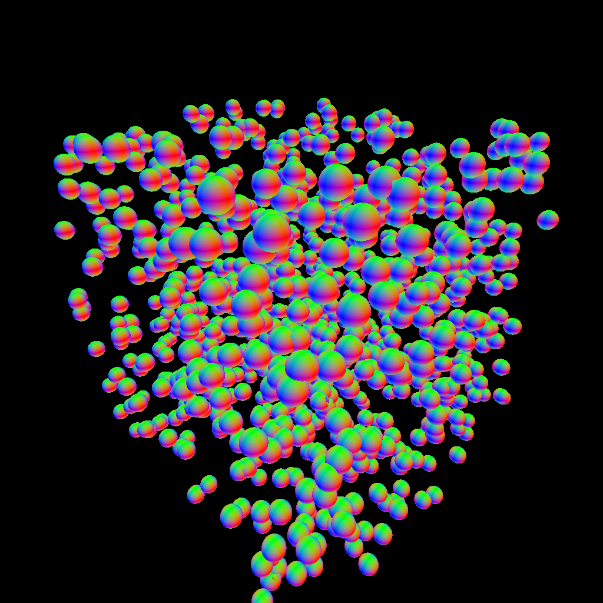
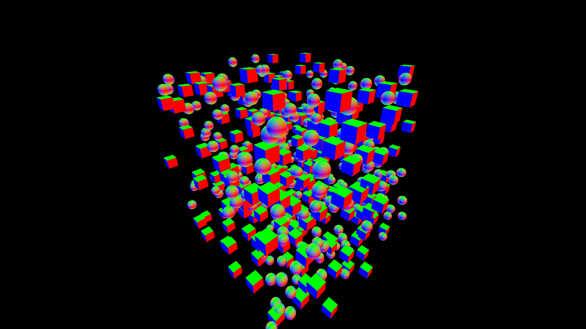

# Homework 3 - BVH

## DEBUG

1. `Sphere.h` 少分號
2. `Sphere.h` 需要 public 繼承 `Object.h`
3. `Sphere.h` 建構子不是 public 的

顏色是根據根據物件交點的法向量(Normal)的各分量來決定。

- x 分量決定紅色(R)
- y 分量決定綠色(G)
- z 分量決定藍色(B)

DEBUG 完後輸出結果如下:



## 修改

### 增加模型

1. 增加立方體(Cube.h)

### 修改觀看螢幕大小

修改觀看螢幕大小

```cpp
const unsigned int width = 1920, height = 1080;
```

如果螢幕寬度和高度不是 1:1，要乘上長寬比才不會被壓縮。

```cpp
float u = (i + .5f) / (float)(width - 1) - .5f;
u*=(float)width/(float)height;
```

### 修改物件數量

```cpp
const unsigned int N = 500;
```

修改完輸出結果如下:

- 增加立方體
- 修改觀看螢幕大小 (1920x1080)
- 修改物件數量後的結果 (500)。



## 比較

| 視窗大小\物件數量 | 500                                | 1000                               | 2000                               | 5000                                |
| ----------------- | ---------------------------------- | ---------------------------------- | ---------------------------------- | ----------------------------------- |
| 500x500           | Build BVH: 0ms <br> Render: 293ms  | Build BVH: 1ms <br> Render: 233ms  | Build BVH: 4ms <br> Render: 310ms  | Build BVH: 12ms <br> Render: 237ms  |
| 1000x1000         | Build BVH: 0ms <br> Render: 1206ms | Build BVH: 2ms <br> Render: 1152ms | Build BVH: 3ms <br> Render: 1393ms | Build BVH: 12ms <br> Render: 1159ms |
| 1920x1080         | Build BVH: 0ms <br> Render: 2572ms | Build BVH: 1ms <br> Render: 2029ms | Build BVH: 4ms <br> Render: 2356ms | Build BVH: 11ms <br> Render: 2406ms |

## BVH 說明

### main

1. 建立物件
2. 構建 BVH
3. 建立相機
4. 渲染畫面，使用 BVH 判斷每個像素是否有碰到物件，並決定顏色

### 計算附載

計算附載會在渲染畫面的時候，時間會是構建 BVH 的好幾倍

### LeafSize = 4

BVH 在建立時會切割成子節點，切割完後該節點物件數量小於 LeafSize 後該節點就不再切割。

這樣可以避免建的樹太深。

### build()

1. 把全部物件算做一個節點
2. 算出節點的碰撞箱和重心
3. 如果節點的物件數量小於 LeafSize 就當葉節點
4. 反之嘗試把節點的物件根據規則切割成兩邊，如果切割失敗，就強制平分成兩邊
5. 把切割完的兩邊節點回到步驟 2 計算
6. 當沒有節點需要切割，複製結果到輸出陣列，完成構建 BVH
