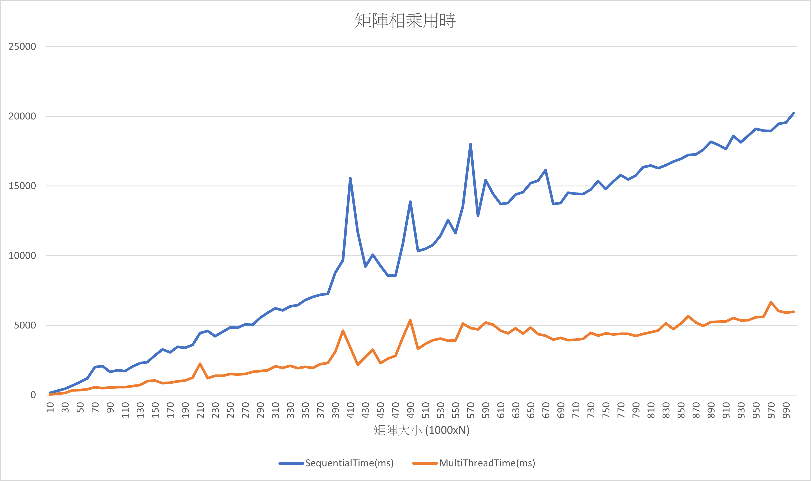

# Homework 4 – Matrix Multiplication

## Matrix

矩陣類別包含基本資料(行數、列數和元素)及乘法運算

```cpp
class Matrix
{
private:
    size_t rows;
    size_t cols;
    std::vector<int> data;
    void MultiplyPartial(const Matrix &other, Matrix &result, size_t start_row, size_t end_row) const;

public:
    Matrix(size_t rows, size_t cols);
    ~Matrix();
    int Get(int row, int col) const;
    void Set(int row, int col, int value);
    size_t RowSize() const;
    size_t ColumnSize() const;
    Matrix SequentialMul(const Matrix &other) const;
    Matrix MultiThreadMul(const Matrix &other) const;
    bool operator==(const Matrix &other) const;
};
```

### SequentialMul

根據矩陣相乘的定義，把第 `i` 個 `row` 和第 `j` 個 `column` 裡的對應元素相乘並相加。

```cpp
Matrix Matrix::SequentialMul(const Matrix &other) const
{
    if (cols != other.rows)
    {
        throw std::invalid_argument("Incompatible matrix sizes for multiplication.");
    }

    Matrix result(rows, other.cols);

    for (size_t i = 0; i < rows; ++i)
    {
        for (size_t j = 0; j < other.cols; ++j)
        {
            int sum = 0;
            for (size_t k = 0; k < cols; ++k)
            {
                sum += Get(i, k) * other.Get(k, j);
            }
            result.Set(i, j, sum);
        }
    }

    return result;
}
```

### MultiThreadMul

根據矩陣相乘的定義做計算，但是把計算分給多個 thread 處理，同時計算減少整體運算時間，並且因為計算時不會互相引響，所以不會有競爭條件。

```cpp
Matrix Matrix::MultiThreadMul(const Matrix &other) const
{
    if (cols != other.rows)
    {
        throw std::invalid_argument("Incompatible matrix sizes for multiplication.");
    }

    // 撈出 thread 數量
    size_t num_threads = std::thread::hardware_concurrency();
    std::vector<std::thread> threads(num_threads);
    Matrix result(rows, other.cols);

    // 每個 thread 負責的 row 範圍
    size_t rows_per_thread = (rows + num_threads - 1) / num_threads;

    for (size_t t = 0; t < num_threads; ++t)
    {
        size_t start_row = t * rows_per_thread;
        size_t end_row = std::min(start_row + rows_per_thread, rows);
        // 計算範圍內的 row
        threads[t] = std::thread(&Matrix::MultiplyPartial, this, std::ref(other), std::ref(result), start_row, end_row);
    }

    for (auto &th : threads)
        th.join();

    return result;
}

// 計算範圍內的 row
void Matrix::MultiplyPartial(const Matrix &other, Matrix &result, size_t start_row, size_t end_row) const
{
    for (size_t i = start_row; i < end_row; ++i)
    {
        for (size_t j = 0; j < other.cols; ++j)
        {
            int sum = 0;
            for (size_t k = 0; k < cols; ++k)
            {
                sum += Get(i, k) * other.Get(k, j);
            }
            result.Set(i, j, sum);
        }
    }
}
```

## 計算負載

矩陣乘法時間複雜度是 $O(n^{3})$，本身就是一種計算量非常龐大的操作。

使用多個 thread 是把運算量分散到不同地方同時運算，減少總計算時間。

## 測試

### 1000x500 和 500x1000 的矩陣相乘

- Sequential Mul Time: 9491.31 ms
- MultiThread Mul Time: 2674.37 ms

### 1000xN 和 Nx1000 的矩陣相乘 (N 從 10~1000)

單執行緒和多執行緒在不同大小矩陣相乘情況下用時:

